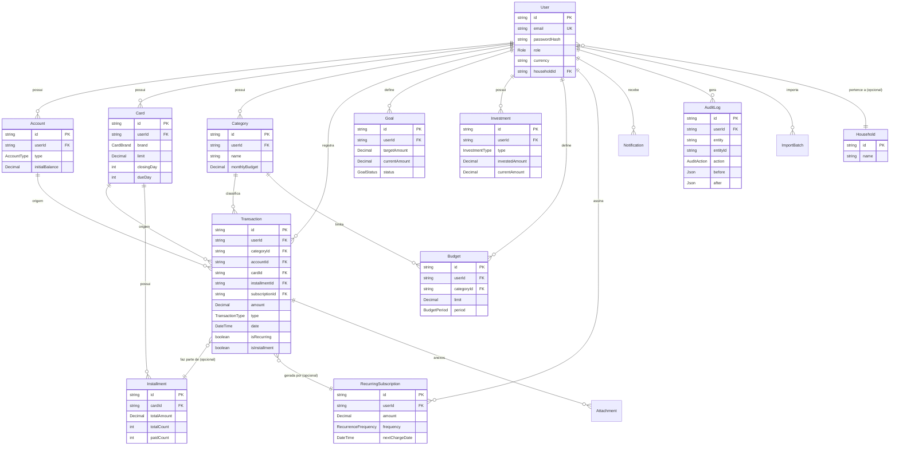

# Schema do banco de dados

Diagrama entidade-relacionamento simplificado (alguns campos omitidos por
brevidade — o schema completo está em `prisma/schema.prisma`).

## Decisões de modelagem que valem revisitar

- **Cascade vs. SetNull**: relações "pertence a" (ex: `Transaction.userId`) usam
  `Cascade` — apagar o usuário apaga tudo dele. Relações "classificado por" (ex:
  `Transaction.categoryId`) usam `SetNull` — apagar a categoria não apaga o
  histórico de transações, só remove a classificação.
- **Decimal, nunca Float**: todo valor monetário é `Decimal(14,2)` (ou
  `Decimal(18,8)` para quantidade de ativos como cripto). Evita erro de
  arredondamento acumulado em somas.
- **Enums para todo domínio fechado**: `Role`, `AccountType`, `CardBrand`,
  `InvestmentType`, `TransactionType`, `GoalStatus`, `BudgetPeriod`,
  `RecurrenceFrequency`, `ImportSource`, `ImportStatus`, `NotificationType`,
  `AuditAction` — nunca strings soltas para esses campos.
- **`Household` já existe, mas está subutilizado**: o campo existe desde a
  Etapa 2 para suportar controle financeiro compartilhado entre membros da
  família, mas o fluxo de convite/aceite de membros não foi construído (ver
  "Próximos passos" no README, Etapa 9).
